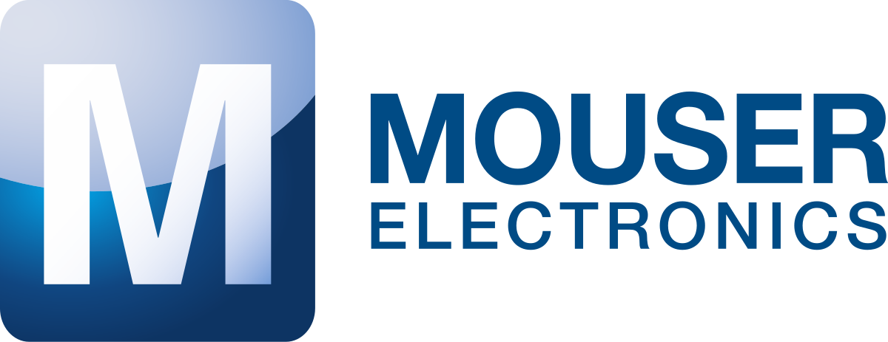
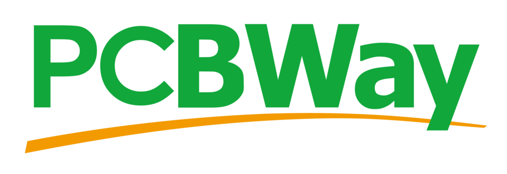

# 💫 Sobre mim:

Me chamo Julia, tabém sou conhecida como **Julialabs, sua blogueirinha de hardware favorita!** Sou produtora de conteúdo, engenheira de computação e trabalho com desenvolvimento, montagem e fabricação de Hardware desde 2019.

Estou sempre aprendendo e explorando novas tecnologias, e aqui no meu GitHub você encontrará repositórios relacionados a Hardware, IOT, programação para Arduino e outras tecnologias com as quais estou trabalhando.

Sinta-se à vontade para explorar meus projetos e deixar um feedback!
Se você replicar algum projeto, não deixe de me marcar no Instagram (**@juliallabs**), vou adorar ver o que você desenvolveu também!

# 🗂️ O que você encontra no meu Github:

🤖 Projetos com Arduino e ESP8266

⚙️ Projetos de placas de circuito impresso

👩‍🏫️ Repositórios de vídeo aulas

🌟 Muitos projetos com LEDs

# 💻 Tecnologias que eu utilizo

## 🌐 Minhas redes:

**E-mail : contato@julialabs.com.br**

# Apoiadores

